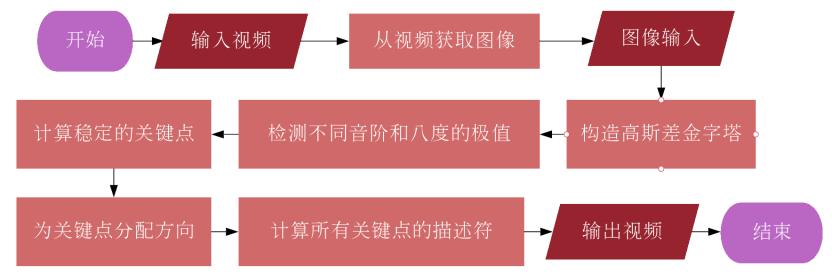
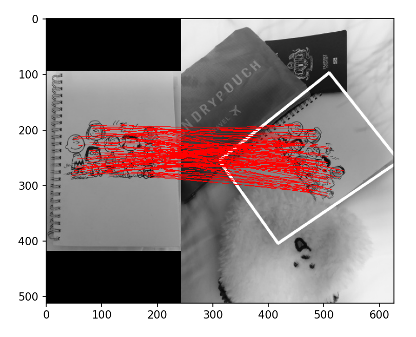
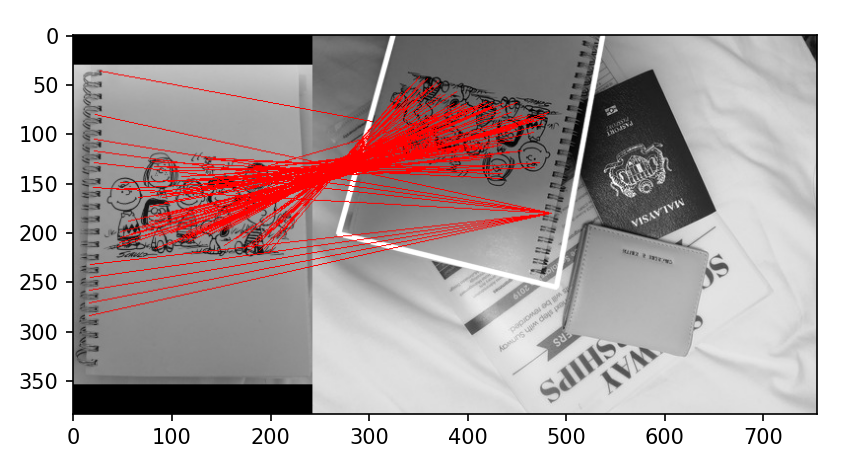
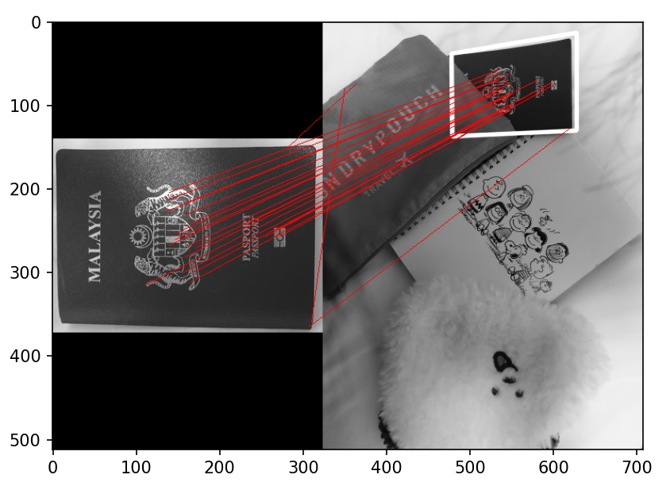
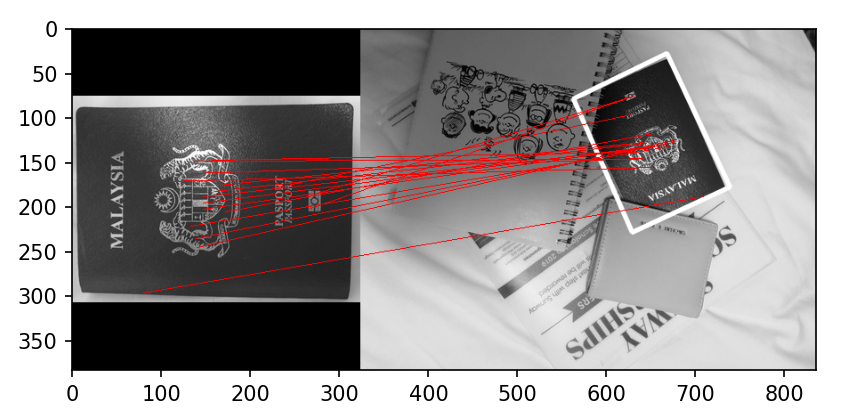
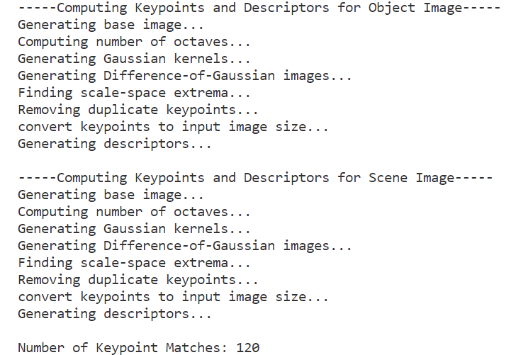

# SIFT-Implementation
 Image Keypoints and Descriptors Detection using SIFT

 

## Algorithm Flowchart

 

## Result

| 物体图像                       | 场景图像                                         | SIFT 图像匹配                  |
| :---------------------------: | :-------------------------------------------: | :------------------------------: |
|  |  |  |
|  |  |  |

| 物体图像                       | 场景图像                                         | SIFT 图像匹配                  |
| :------------------------------: | :------------------------------------------------: | :------------------------------: |
|  |  |  |
|  |  |  |

 

### Keypoint matches

| SIFT 图像匹配                   | 匹配关键点对数 |
| :----------------------------: | :------------: |
|  | 120            |
|  | 133            |

| SIFT 图像匹配                                                | 匹配关键点对数 |
| :------------------------------------------------------------: | :--------------: |
|  | 27             |
|  | 19             |

 

|  |
| ------------------------------------------------------------ |

